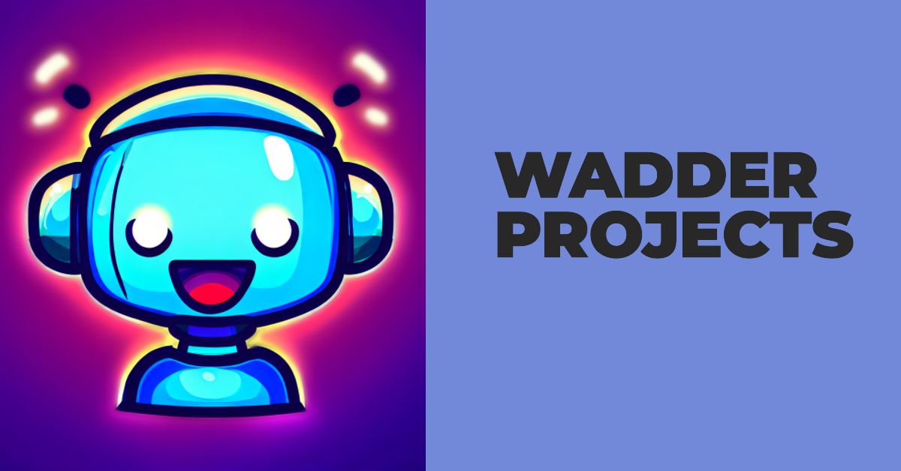

# QuantaAI: Revolutionizing Discord Server Management

QuantaAI is an AI-powered Discord bot designed to streamline server management and enhance user experience. With its unique ability to establish global partnerships, innovative AI commands including a language learning tool, and a user-friendly design, QuantaAI is breaking down communication barriers and fostering a safer, more connected digital community.

## 🔑 Key Features

1. **AI-Powered Tools**: QuantaAI leverages advanced AI technology to offer unique features like language learning and content moderation.

2. 🌍 **Global Connectivity**: QuantaAI fosters global connections by allowing servers to share and receive events worldwide.

3. 📚 **Language Learning**: QuantaAI's AI Language Learner tool breaks down language barriers, enabling servers to communicate in any language.

4. ⚖️ **Content Moderation**: QuantaAI uses AI to detect and flag inappropriate content, ensuring a safe and positive environment for users.

5. 🖥️ **User-Friendly Interface**: QuantaAI is designed to be easy to use, with a simple, intuitive interface that's free of complicated dashboards.

6. 💲 **Free Access**: QuantaAI offers all its features, including API usage from OpenAI, completely free of charge.

7. 🤝 **Community Building**: QuantaAI's features are designed to foster community, making it easier for users to connect and collaborate.

8. 🛠️ **Server Management**: QuantaAI streamlines server management, making it easier to manage large communities and keep everything organized.

9. 🎛️ **Customizable Commands**: QuantaAI boasts over 200 commands, allowing for a high degree of customization to suit the needs of any server.

10. ⚙️ **Scalability**: QuantaAI is designed to work effectively in servers of any size, from small groups to large communities.

11. 🔄 **Continuous Development**: QuantaAI is continuously updated and improved, ensuring it stays at the forefront of AI technology.

12. 📚 **Documentation and Support**: QuantaAI provides comprehensive documentation and support to help users get the most out of the bot.

## Getting Started

To get started with QuantaAI, visit the bot's [documentation](http://wadderprojects.bhweb.ws/documentation/documentation-html-template-master/docum.html) on the website.

